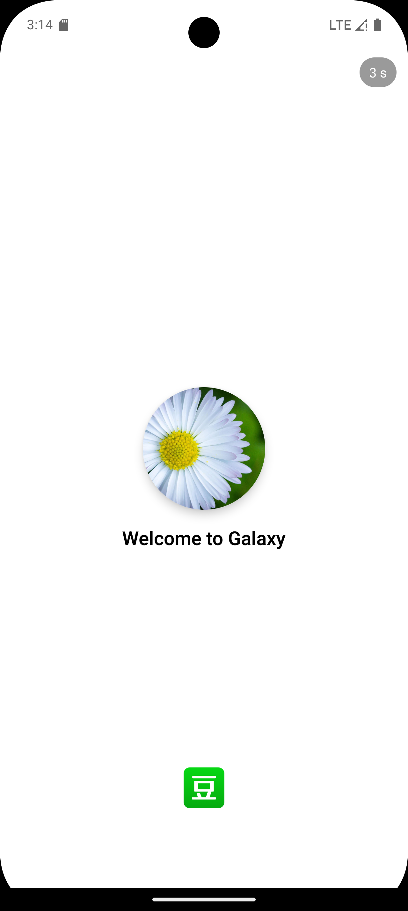

## 项目简介（React-Native练手）

`galaxy` 是一个基于 React-Native 的移动端示例应用，参考了豆瓣类的书影音界面，包含首页、列表、详情页和底部导航等常见布局。

主要功能：
- 使用 React-Native 构建跨平台移动界面（iOS/Android）
- 仿豆瓣风格的书影音列表与详情展示

## 演示与素材

项目中包含若干用于 README 演示的图片与视频素材，存放在 `src/assets/images/`：

- `src/assets/images/splash_page.png`：启动页示例截图
- `src/assets/images/book_videos_page.png`：书影音页面示例截图
- `src/assets/images/detail_page.png`：详情页示例截图

效果图演示：

